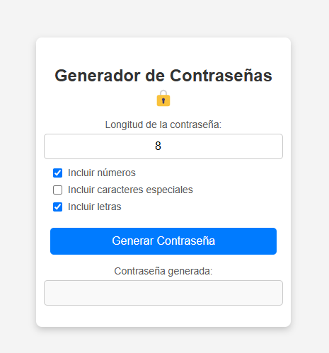

# 🔒 Generador de Contraseñas Seguras

Este es un generador de contraseñas personalizable que permite al usuario elegir la longitud de la contraseña y seleccionar qué tipos de caracteres incluir (letras, números y caracteres especiales).

## 🚀 Características

✅ **Longitud Personalizable**: Puedes elegir entre 4 y 20 caracteres.
✅ **Selección de Caracteres**: Decide si incluir números, caracteres especiales y/o letras.
✅ **Interfaz Moderna**: Diseño limpio y fácil de usar.
✅ **Código Modular**: Separación entre HTML, CSS y JavaScript para mayor claridad.

## 📸 Vista Previa

🔹 **Formulario de generación de contraseñas:**
 *(Agrega una captura de pantalla aquí)*
